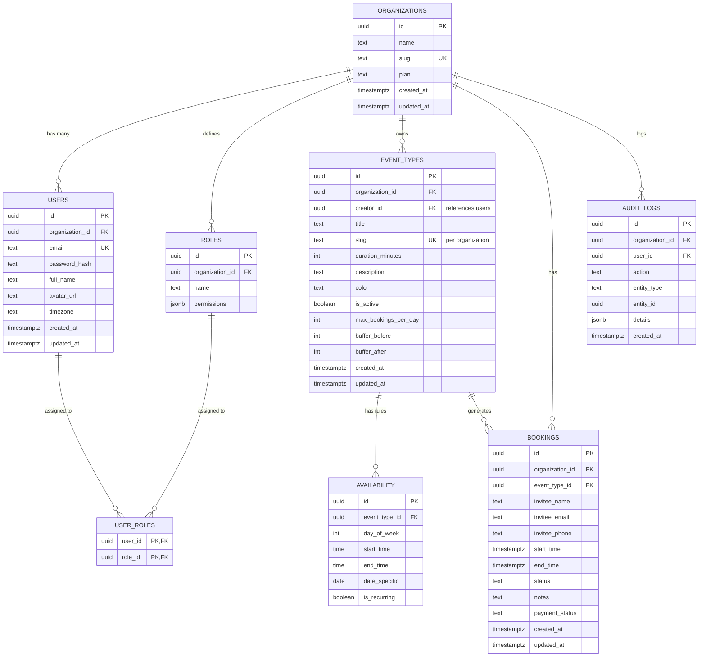

# Database Schema

Database: PostgreSQL
ORM: Drizzle ORM
Architecture: Multi-organization SaaS appointment system

This schema should supports:
- multi-tenancy accounts
- booking scheduling
- availability windows
- blocked time ranges
- Google Calendar integration
- WhatsApp notifications
- booking cancel / reschedule tokens
- SaaS subscriptions (future)

All times should be stored in UTC.

## Tables Overview
- users
- organizations
- roles
- user_roles
- event_types
- availability
- bookings
- audit_logs

## Entity Relationship Diagram

### Key Schema Design Decisions

| Decision | Rationale |
|----------|-----------|
| **`availability` per day-of-week** | Simple recurring pattern — Mon 9-17, Tue 10-18, etc. |
| **`event_type_id` nullable on availability** | null = applies to all services (default schedule) |
| **`settings` JSONB on organizations** | Flexible config (booking lead time, cancellation policy, branding) |
| **`metadata` JSONB on bookings** | Extensible (UTM tracking, referral source, etc.) |
| **Session table for Better Auth** | Better Auth auto-creates `sessions` + `accounts` tables |
| **Soft-delete via `is_active`** | No hard deletes for data integrity |
| **`organization_id` on all organization tables** | Core multi-tenancy filter — every query scopes by organization |
| **All times stored in UTC** | Display converted to organization timezone (WIB/WITA/WIT) |

---

## Multi-Tenancy + RBAC Design

### Multi-Tenancy Strategy

- **Row-Level Isolation** via `organization_id` on all organization-scoped tables
- Every database query in repositories MUST include `WHERE organization_id = ?`
- Middleware extracts `organization_id` from the authenticated user's session
- A helper `requireBusinessAccess(userId, organizationId)` guards all API routes

### RBAC Roles

| Role | Capabilities |
|------|-------------|
| **owner** | Full access: billing, team management, delete organization, all CRUD |
| **admin** | Manage services, availability, bookings, view analytics. No billing or team changes |
| **staff** | View own bookings, update booking status, view schedule |