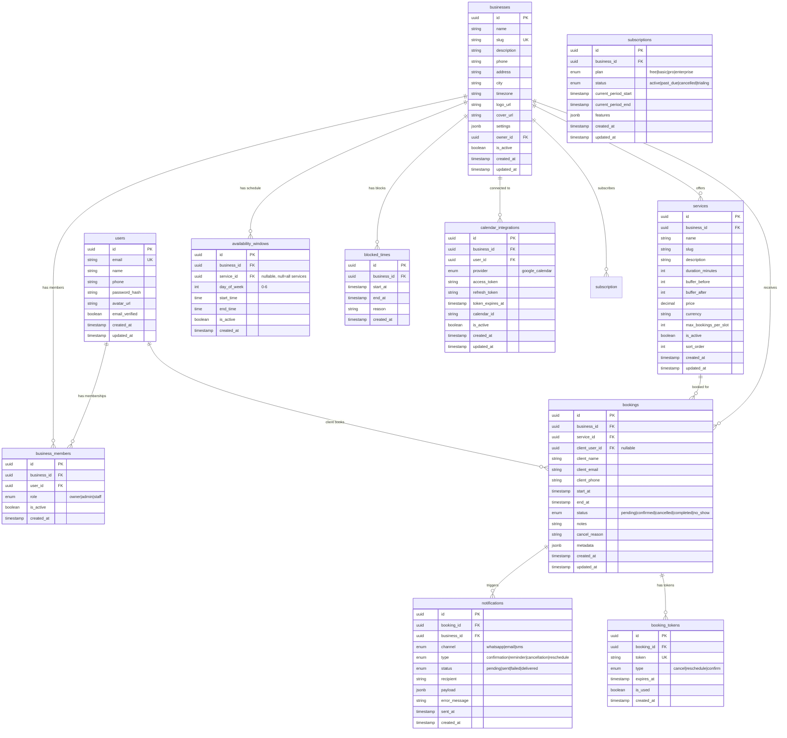

# Database Schema

Database: PostgreSQL
ORM: Drizzle ORM
Architecture: Multi-tenant SaaS appointment system

This schema should supports:
- multi-tenancy accounts
- booking scheduling
- availability windows
- blocked time ranges
- Google Calendar integration
- WhatsApp notifications
- booking cancel / reschedule tokens
- SaaS subscriptions (future)

All times should be stored in UTC.

## Tables Overview
- users
- businesses
- business_members
- services
- availability_windows
- blocked_times
- bookings
- booking_tokens
- calendar_integrations
- notifications
- subscriptions

## Entity Relationship Diagram

### Key Schema Design Decisions

| Decision | Rationale |
|----------|-----------|
| **`business_members` junction table** | Enables proper RBAC — a user can be staff in multiple businesses |
| **`client_user_id` is nullable on bookings** | Clients can book without registering (guest booking) |
| **`availability_windows` per day-of-week** | Simple recurring pattern — Mon 9-17, Tue 10-18, etc. |
| **`service_id` nullable on availability_windows** | null = applies to all services (default schedule) |
| **`settings` JSONB on businesses** | Flexible config (booking lead time, cancellation policy, branding) |
| **`metadata` JSONB on bookings** | Extensible (UTM tracking, referral source, etc.) |
| **Session table for Better Auth** | Better Auth auto-creates `sessions` + `accounts` tables |
| **Soft-delete via `is_active`** | No hard deletes for data integrity |
| **`business_id` on all tenant tables** | Core multi-tenancy filter — every query scopes by business |
| **All times stored in UTC** | Display converted to business timezone (WIB/WITA/WIT) |

---

## Multi-Tenancy + RBAC Design

### Multi-Tenancy Strategy

- **Row-Level Isolation** via `business_id` on all tenant-scoped tables
- Every database query in repositories MUST include `WHERE business_id = ?`
- Middleware extracts `business_id` from the authenticated user's session
- A helper `requireBusinessAccess(userId, businessId)` guards all API routes

### RBAC Roles

| Role | Capabilities |
|------|-------------|
| **owner** | Full access: billing, team management, delete business, all CRUD |
| **admin** | Manage services, availability, bookings, view analytics. No billing or team changes |
| **staff** | View own bookings, update booking status, view schedule |